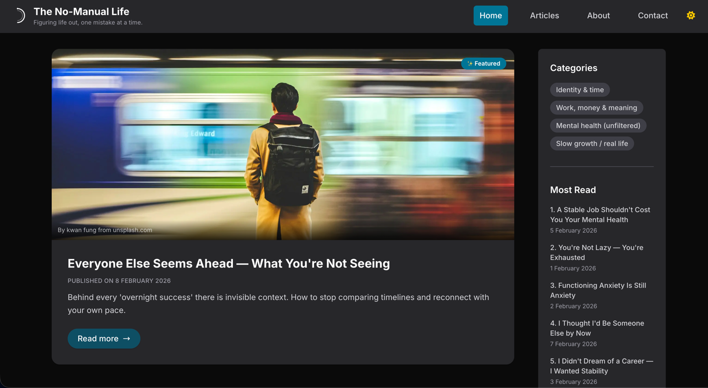

# The No-Manual Life Blog

### Accessibility-First Frontend Engineering Project

---

## 📌 Overview

The No-Manual Life Blog is a modern frontend engineering project built with **accessibility as a primary architectural
constraint**.

This is not just a blog application — it is a structured environment created to practise, refine, and document inclusive
engineering patterns using scalable frontend architecture.

The project is intentionally designed to prioritise:

- Accessibility-first thinking
- Semantic structure
- Performance discipline
- Clean component architecture
- Type-safe development

It serves as both a learning laboratory and a professional showcase of accessibility-driven frontend engineering.

---

## 🎯 Engineering Focus

This project follows **WCAG 2.1 Level AA guidelines** and explores:

- Semantic HTML5 and proper landmark usage
- Keyboard-first interaction design
- Strategic and minimal ARIA usage
- Focus management and logical tab order
- Accessible typography and colour contrast
- Progressive enhancement principles
- Performance optimisation for constrained devices
- Robust, scalable component architecture

Accessibility is treated as a system-level concern — not a post-build adjustment.

---

## 🚀 Tech Stack

- **Next.js (App Router)**
- **TypeScript**
- **Tailwind CSS**
- **@axe-core/react** (accessibility testing)
- **Lighthouse validation**
- **Vercel deployment**

---

## 🌐 Live Preview

🔗 https://the-no-manual-life-blog.vercel.app/

---

## 🧠 Project Intent

This project is intentionally iterative.

The current implementation focuses primarily on accessibility foundations and structural quality.  
Future phases will expand into:

- Architecture scalability
- Dynamic content management
- Product-level UX improvements
- Advanced performance strategies
- Internationalisation
- Progressive Web App capabilities

---

## 🗺 Roadmap

See [`ROADMAP.md`](./ROADMAP.md) for structured development phases and future evolution plans.

---

## 👩‍💻 Author

Created by **Patricia Segantine**  
Frontend Developer focused on scalable systems, performance discipline, and accessible engineering.

*Building reliable frontend systems — with accessibility as a constraint, not an afterthought.*